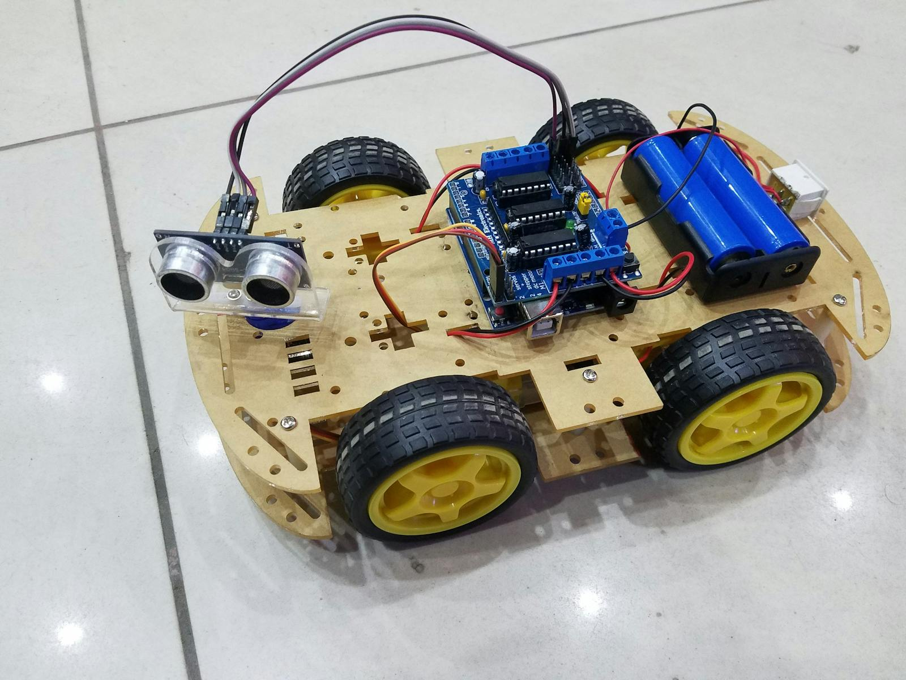
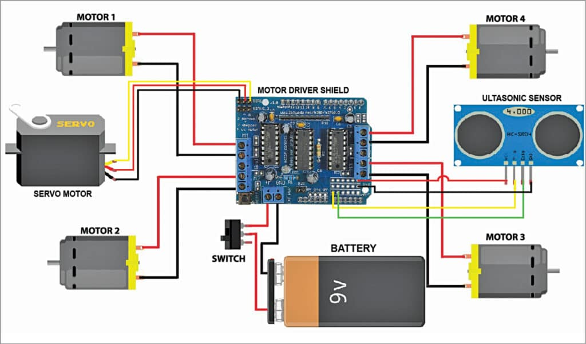

# Arduino-Obstacle-Avoiding-Robot-Car

## Hardware

1. Arduino Uno R3
2. L293D Motor Driver Shield
3. Micro Servo
4. Ultrasonic Sensor Module
5. 4 x Geared DC Motors & Wheels
6. 9-12V Battery Pack
7. 8 x M3 x 15mm Socket Head Screws
8. Ribbon Cable
9. Header Pins

## Software

- Arduino IDE
- Language: C/C++

## Wiring Instructions

Below is the wiring table for connecting the Arduino and components:

| **Component/Module**      | **Pin Description**         | **Connection to Arduino** |
| ------------------------- | --------------------------- | ------------------------- |
| **Ultrasonic Sensor**     | TRIG (Trigger signal)       | A0                        |
|                           | ECHO (Echo signal)          | A1                        |
|                           | VCC (Power)                 | 5V                        |
|                           | GND (Ground)                | GND                       |
| **Servo Motor**           | Signal Control Pin          | D10                       |
|                           | VCC (Power)                 | 5V                        |
|                           | GND (Ground)                | GND                       |
| **Adafruit Motor Shield** | Motor 1 (M1)                | Motor 1 (M1 terminal)     |
|                           | Motor 2 (M2)                | Motor 2 (M2 terminal)     |
|                           | Motor 3 (M3)                | Motor 3 (M3 terminal)     |
|                           | Motor 4 (M4)                | Motor 4 (M4 terminal)     |
|                           | VIN (Motor power supply)    | External 12V              |
|                           | GND (Common ground)         | Arduino GND               |
|                           | SDA/SCL (I2C communication) | SDA/SCL (D2/D3)           |

1. **Ultrasonic Sensor**:

   - Connect the TRIG pin to A0 and the ECHO pin to A1.
   - Connect the VCC pin to 5V and GND pin to Arduino's GND.

2. **Servo Motor**:

   - Connect the signal control pin (usually white/yellow) to D10.
   - Connect the red wire (VCC) to 5V and the black wire (GND) to Arduino's GND.

3. **Adafruit Motor Shield**:

   - Mount the Motor Shield directly onto the Arduino.
   - Connect the motors to terminals M1, M2, M3, and M4 on the shield.
   - Provide an external 12V power supply to the VIN terminal.
   - Connect the shield's GND to the Arduino's GND.

4. **Common Ground**:
   - Ensure a shared ground (GND) connection between the Arduino, Motor Shield, Servo, and Ultrasonic Sensor.

#### Notes

- Make sure to install the required libraries before uploading the code to the Arduino.
- Verify the voltage ratings for each component.
- Ensure the external power supply provides sufficient current for the motors.

## Here is some example image

